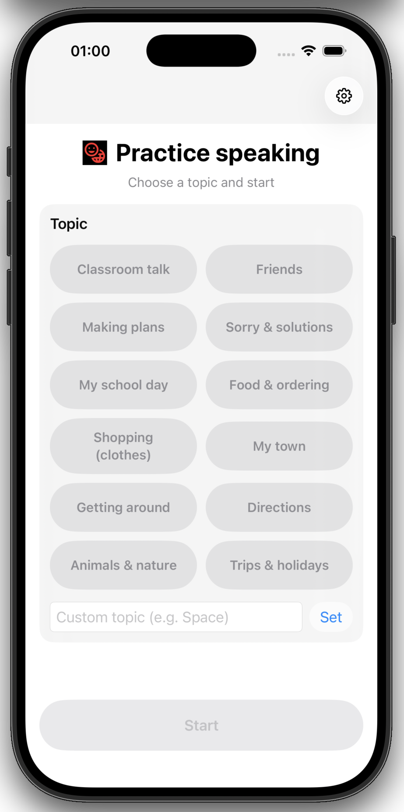

# Language Speaking Trainer

Native iOS (**SwiftUI**) app for a kids‑friendly English speaking trainer.

## What this does

- Pick a topic (or enter a custom one)
- Start a speaking session
- Keep the flow simple and age‑appropriate

## Repo layout

- `ios/` — the iOS app (SwiftUI)
- `api/` — Vercel serverless functions (ephemeral token minting)
- `features/` — BDD/Gherkin acceptance criteria (scenario IDs like `@SE-001`)
- `docs/` — backend + iOS setup notes

If you want a single “what’s planned vs what’s implemented” index, see `features/FEATURE_REGISTRY.md`.

## Current status

Implemented UI flows matching the MVP BDD:

- Home/topic selection
- Settings
- Session UI
- Privacy constraints: no long‑term raw audio storage (nothing is persisted)

Not implemented yet:

- Full OpenAI Realtime WebRTC connection (some parts are mocked / in progress)

## Run it locally

### iOS app

You need **Xcode**.

- Open: `ios/App/LanguageSpeakingTrainer/LanguageSpeakingTrainer.xcodeproj`
- Run the `LanguageSpeakingTrainer` scheme on a simulator or your device

iOS setup details (including token service configuration) live in `ios/README.md`.

### Backend (Vercel)

The backend lives in `api/` and is designed to run on Vercel.

- Docs: `docs/backend-vercel.md`
- Local dev is typically via `vercel dev` (see `vercel.json`)

## Branding / assets

The app icon and the in‑app logo mark are derived from Google **Material Symbols** (`emoji_language`).
Attribution and license notes are in `docs/brand/THIRD_PARTY_NOTICES.md`.

